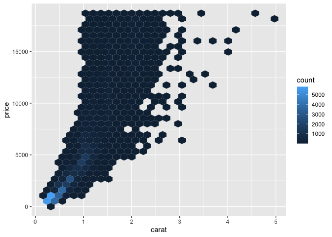

```
## Loading required package: tidyverse
```

```
## ── Attaching packages ─────────────────────────────────────── tidyverse 1.3.1 ──
```

```
## ✓ ggplot2 3.3.3     ✓ purrr   0.3.4
## ✓ tibble  3.1.2     ✓ dplyr   1.0.6
## ✓ tidyr   1.1.3     ✓ stringr 1.4.0
## ✓ readr   1.4.0     ✓ forcats 0.5.1
```

```
## ── Conflicts ────────────────────────────────────────── tidyverse_conflicts() ──
## x dplyr::filter() masks stats::filter()
## x dplyr::lag()    masks stats::lag()
```

Plotting diamond data using hex_geom.


```r
ggplot( diamonds, aes(carat, price)) +
  geom_hex()
```

<!-- -->

